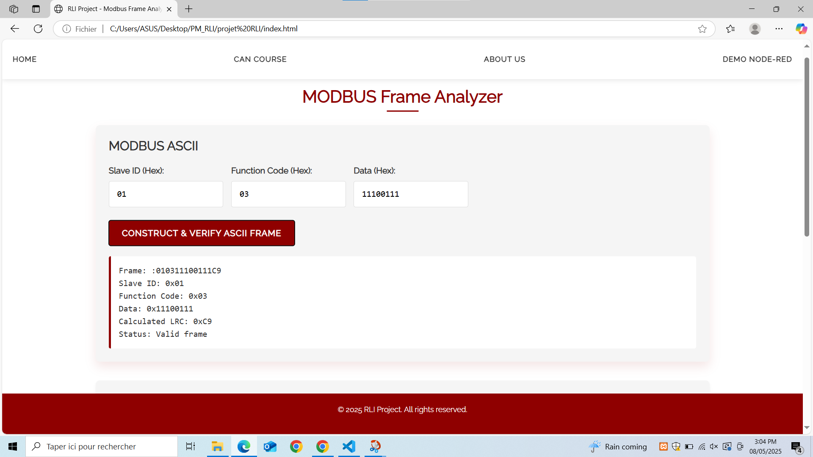
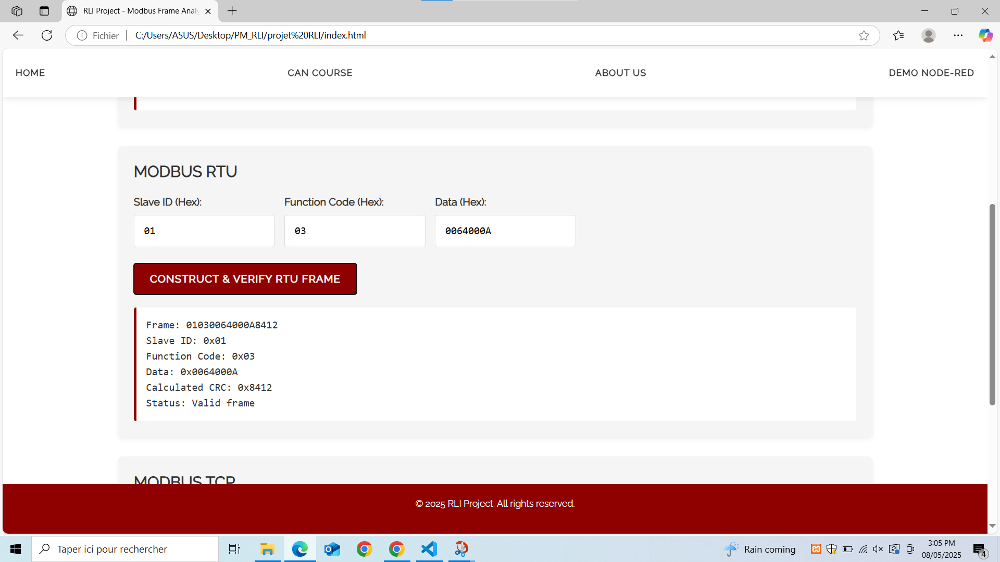
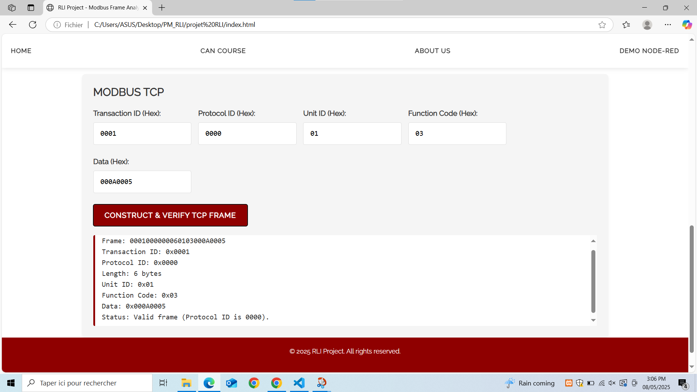
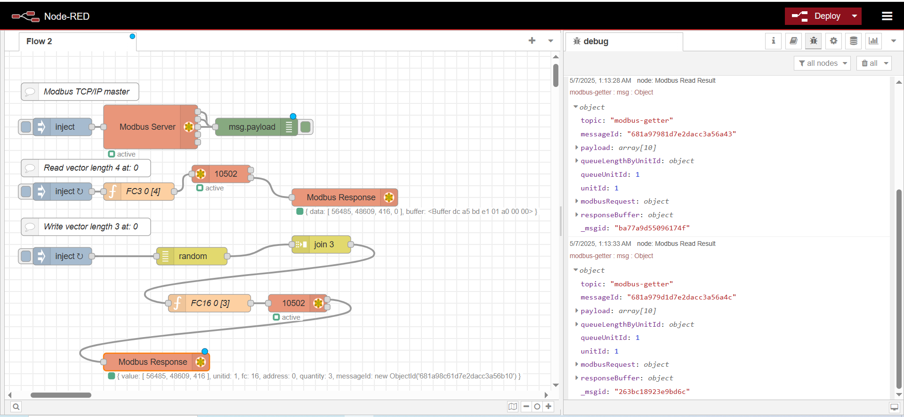
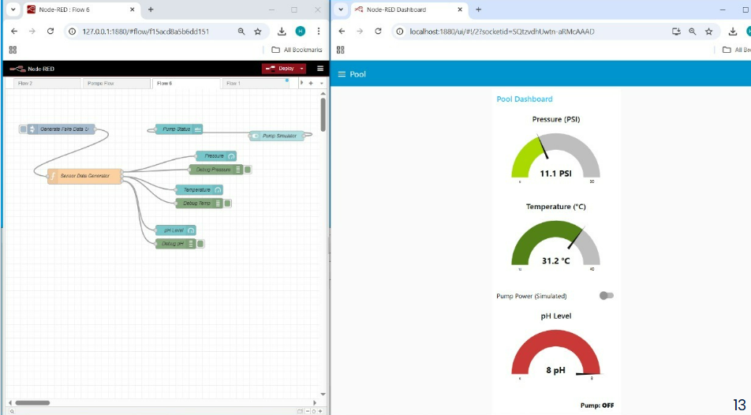
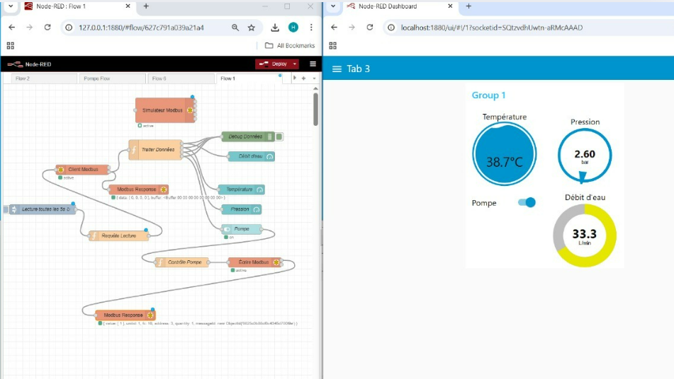

# 📡 Projet Réseaux Industriels - MODBUS TCP/IP

Ce projet a été réalisé dans le cadre du module **Réseaux Industriels (RI)**. Il a pour objectif d’explorer le protocole **MODBUS TCP/IP**, ses différentes variantes et de mettre en œuvre une application de communication en temps réel à l’aide de **Node-RED**.

### ✅ Partie 1 : Développement Web

Création d’un site web interactif permettant la **saisie et le calcul automatique de trames Modbus** :

- 🔤 **MODBUS ASCII** : génération de trames avec calcul du **LRC (Longitudinal Redundancy Check)**
- 🔣 **MODBUS RTU** : génération de trames avec calcul du **CRC (Cyclic Redundancy Check)**
- 🌐 **MODBUS TCP/IP** : génération de trames avec calcul et affichage structuré
- ✅ Interface web simple et intuitive

### ✅ Partie 2 : Application en temps réel

- Mise en place d’une **communication réelle avec MODBUS TCP** via le logiciel **Node-RED**
- Simulation de trames envoyées/reçues en temps réel
- Visualisation des **paquets échangés**, des **valeurs des registres** ou des **coils**
- Application testée et fonctionnelle

## 🔧 Technologies utilisées

- 🧠 **HTML/CSS/JavaScript** – pour l’interface web
- ⚙️ **Bootstrap** – pour le style et la mise en page
- 🔁 **Algorithmes de CRC et LRC** codés en JavaScript
- 🌐 **Node-RED** – pour la communication réseau en temps réel
- 🧪 **Simulation de dispositifs MODBUS TCP (serveur ou client)**

## 📸 Aperçu du projet

### 🧮 Calcul du CRC et LRC

### 🔄 Communication temps réel avec Node-RED

